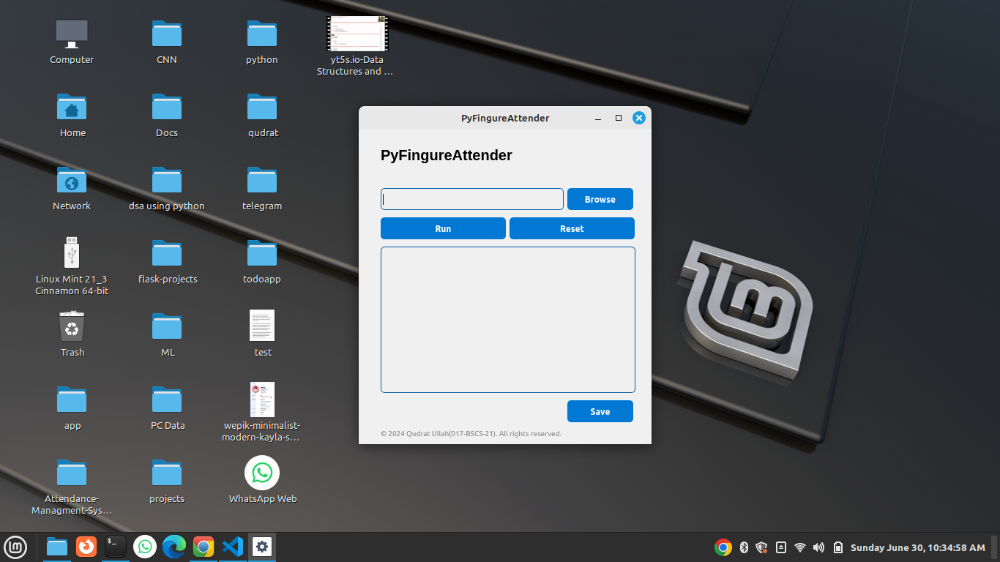
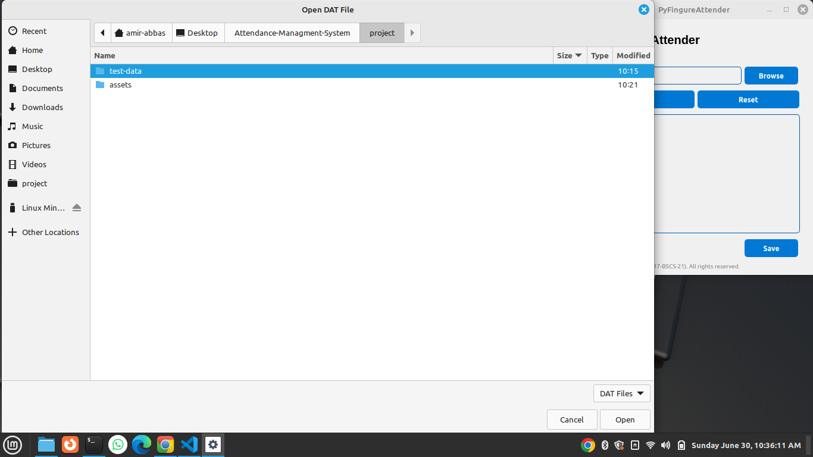
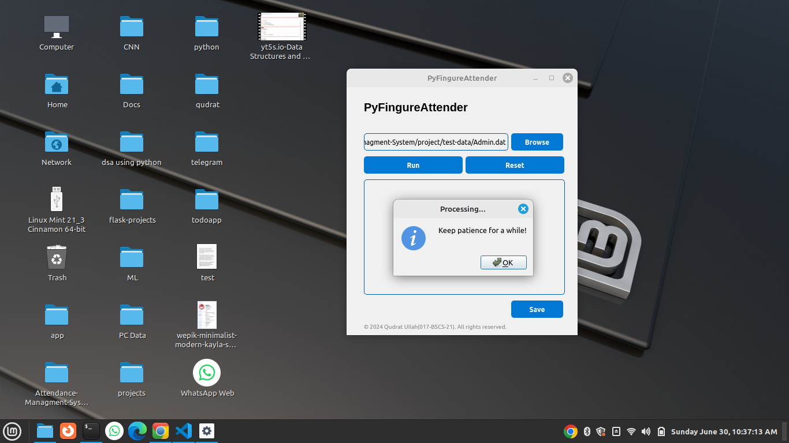
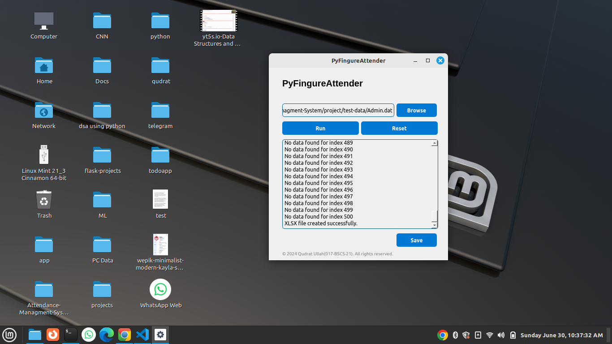

# PyFingureAttender

PyFingureAttender is a desktop application built using Python and PyQt5 for managing attendance logs. It reads attendance data from `.dat` files and generates an Excel file with the processed attendance information.

## Features

- Browse and select `.dat` files containing attendance logs.
- Process and filter attendance data.
- Generate an Excel file with attendance details.
- User-friendly interface with options to browse, run, reset, and save output.
- Handles missing dates and fills them appropriately.

## Prerequisites

- Python 3.x
- PyQt5
- pandas
- openpyxl

## Installation

1. Clone the repository:

```bash
git clone https://github.com/yourusername/pyfingureattender.git
cd pyfingureattender
```

2. Install the required Python packages:

```bash
pip install -r requirements.txt
```

## Usage

1. Run the application:

```bash
python pyfingureattender.py
```

2. The application window will open. Use the "Browse" button to select a `.dat` file.

3. Click "Run" to process the attendance data.

4. Use the "Save" button to save the output in a `.txt` file.

5. To reset the fields, click the "Reset" button.

## File Structure

- `GUI-Based-Application.py`: The main application script.
- `requirements.txt`: Contains the list of required Python packages.
- `assets/icon.ico`: The icon for the application window.

## Screenshots

Here are some screenshots of the PyFingureAttender application:

### Main Window


### Browsing Files


### Processing Data


### Save Output


## License

This project is licensed under the MIT License.

## Author

- Amir Abbas (002-BSCS-21)

## Acknowledgements

- PyQt5 for the GUI framework.
- pandas and openpyxl for data processing and Excel file generation.
